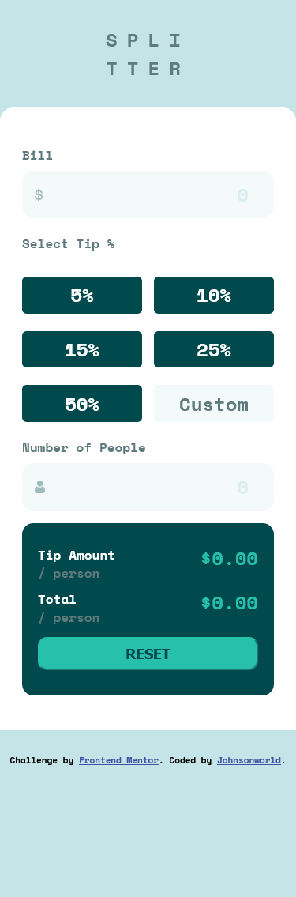
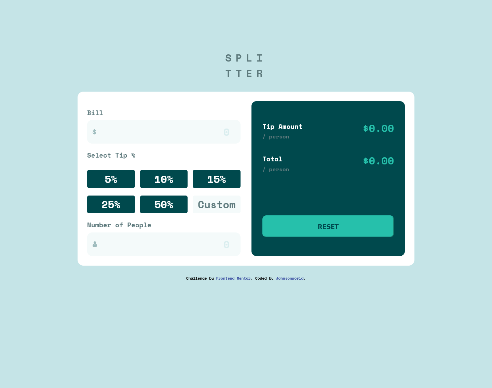
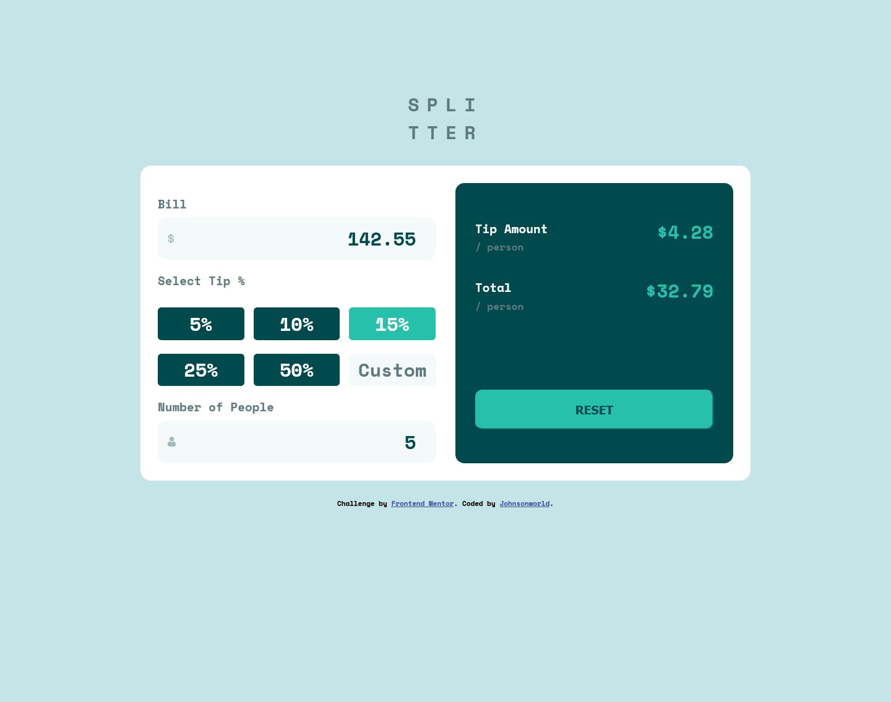

# Frontend Mentor - Tip calculator app solution

This is a solution to the [Tip calculator app challenge on Frontend Mentor](https://www.frontendmentor.io/challenges/tip-calculator-app-ugJNGbJUX). Frontend Mentor challenges help you improve your coding skills by building realistic projects.

## Table of contents

- [Overview](#overview)
  - [The challenge](#the-challenge)
  - [Screenshot](#screenshot)
  - [Links](#links)
- [My process](#my-process)
  - [Built with](#built-with)
  - [What I learned](#what-i-learned)
  - [Continued development](#continued-development)
  - [Useful resources](#useful-resources)
- [Author](#author)
- [Acknowledgments](#acknowledgments)

**Note: Delete this note and update the table of contents based on what sections you keep.**

## Overview

This is a working rendering of the Front End Mentor tip calculator challenge utilizing HTML, CSS & Javascript.

### The challenge

Users should be able to:

- View the optimal layout for the app depending on their device's screen size
- See hover states for all interactive elements on the page
- Calculate the correct tip and total cost of the bill per person

### Screenshot

### Links

- Solution URL: [https://Johnsonworld.github.io/FEMentor_Tip_Calculator/](https://your-solution-url.com)
- Live Site URL: [Add live site URL here](https://your-live-site-url.com)

## My process

Started with mobile first workflow, framed that in, added content, formatted, then used Javascript behind the scenes.  Then using media queries, added responive design for desktop screens.

### Built with

- Semantic HTML5 markup
- CSS custom properties
- Flexbox
- CSS Grid
- Mobile-first workflow
- Javascript

### What I learned

More insight into positioning with Grid & Flexbox.  Also, utilized Javascript more extensively as I used radio buttons for the tip % selectors.  This project helped me better understand the use of HTML DOM selectors and methods. I was able to accomplish what I wanted to, even if the code itself was not as elegant or encapsulated as I would have liked.

I am getting much better with HTML & CSS understanding - particularly framing in the document flow in advance of adding content.  Saves a lot of time and heartache.

### Continued development

This project highlighted the need for further practice and experimentation with the following:

- Code efficiency and formatting - Javascript flow.
- Iterating arrays and objects.

